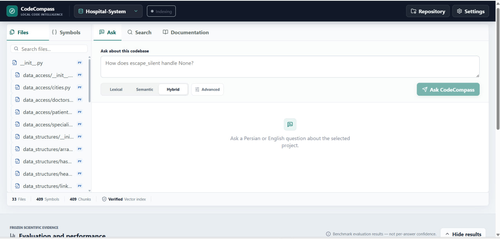
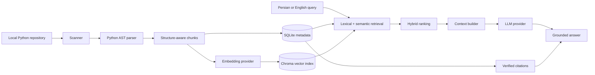
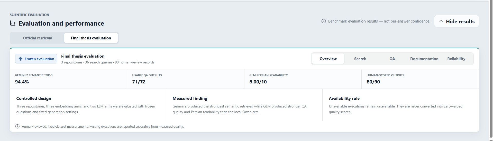

# CodeCompass Local

CodeCompass is a local-first system for understanding Python repositories through Persian or English questions. It combines deterministic code analysis, lexical and semantic retrieval, grounded answer generation, function documentation, and verified navigation to the exact source file, symbol, and line range.

The project was developed as a bachelor's thesis and is complete. The latest release is [`v1.1.0-evaluation-dashboard`](https://github.com/Ftm-Sayadzadeh/codecompass-local/tree/v1.1.0-evaluation-dashboard).



## What It Does

- Scans local Python repositories while excluding secrets, virtual environments, VCS internals, and build output.
- Extracts modules, classes, functions, async functions, methods, signatures, imports, and exact source ranges with Python AST.
- Stores canonical metadata in SQLite and vectors in ChromaDB using stable chunk IDs.
- Supports lexical, semantic, and hybrid retrieval for Persian and English queries.
- Generates grounded answers from retrieved evidence and attaches citations from trusted metadata.
- Generates function documentation by combining deterministic facts with model-written explanations.
- Opens cited code directly in a Monaco-based source explorer.
- Supports Ollama and OpenAI-compatible embedding and generation providers independently.
- Exposes frozen official and final-thesis evaluation results in the UI.

## Architecture



SQLite remains the source of truth for file, symbol, chunk, and citation metadata. The LLM writes natural-language explanations; it does not author trusted paths, symbol identities, or line ranges.

## Research Results

The repository contains two complementary frozen evaluations:

| Evaluation | Scope | Key result |
|---|---|---|
| Official bilingual retrieval benchmark | 60 questions, 30 concepts | Hybrid Top-1 63.3%, Top-3 78.3%, MRR@10 0.732 with the recorded Nomic local setup |
| Final thesis evaluation | 3 repositories, 36 search queries, 72 QA combinations, 18 documentation executions | Gemini Embedding 2 semantic Top-3 94.4%; 71/72 usable QA outputs; 80/90 human-scored outputs |

The final study found a model-dependent trade-off rather than a universal winner: Gemini Embedding 2 produced the strongest semantic retrieval, Gemini Embedding 001 led selected hybrid ranking metrics, and GLM 5.3 Flash produced stronger measured QA and Persian documentation quality than the evaluated local Qwen 3B setup. Missing executions were retained as unavailable and never converted into zero-valued quality scores.



See the [publication report](reports/evaluation/final_thesis_evaluation_v1/final_thesis_evaluation_report.md) and [PDF](reports/evaluation/final_thesis_evaluation_v1/final_thesis_evaluation_report.pdf) for the complete methodology, case-level evidence, limitations, hashes, and human evaluation.

## Requirements

- Python 3.11 or newer
- Node.js `^20.19.0` or `>=22.12.0`
- Ollama when using local embedding or generation models
- Enough disk space for SQLite and Chroma indexes

## Installation

From the repository root:

```powershell
python -m pip install -e ".[dev]"
cd frontend
npm ci
cd ..
```

Automated tests use local fakes and require no paid API or external model service.

## Run Locally

Start the backend from the repository root:

```powershell
$env:CODECOMPASS_DATABASE = "data/codecompass.sqlite"
$env:CODECOMPASS_CHROMA = "data/chroma"
python -m uvicorn codecompass.api:create_app --factory --host 127.0.0.1 --port 8000
```

Start the frontend in another terminal:

```powershell
cd frontend
npm run dev -- --host 127.0.0.1 --port 5173
```

Open [http://127.0.0.1:5173](http://127.0.0.1:5173). Vite proxies `/api` to the backend during development.

Use **Repository** to select and index a local Python project. Use **Provider settings** to configure embedding and LLM providers independently. API keys are kept in browser memory for the current page session and are not persisted by the frontend.

The verified walkthrough is documented in [docs/final-demo-runbook.md](docs/final-demo-runbook.md).

## Provider Configuration

Supported provider types:

- `ollama` for local models.
- `openai_compatible` for endpoints implementing `/v1/embeddings` and `/v1/chat/completions` semantics.

The provider, base URL, model, timeout, optional dimensions, and request-scoped API key can be supplied through the UI. Backend defaults can also be configured with `CODECOMPASS_PROVIDER`, `CODECOMPASS_BASE_URL`, `CODECOMPASS_API_KEY`, `CODECOMPASS_EMBEDDING_MODEL`, `CODECOMPASS_LLM_MODEL`, `CODECOMPASS_TIMEOUT_SECONDS`, and `CODECOMPASS_EMBEDDING_DIMENSIONS`.

An index is compatible only with the embedding provider, model, and dimensions used to create it. CodeCompass validates this identity before semantic or hybrid retrieval. See [docs/providers.md](docs/providers.md) for examples and safety rules.

## Tests

Backend:

```powershell
python -m pytest
```

Frontend:

```powershell
cd frontend
npm test
npm run typecheck
npm run build
```

## Evaluation Artifacts

- [Final thesis evaluation](reports/evaluation/final_thesis_evaluation_v1/)
- [Controlled Qwen vs GLM benchmark](reports/evaluation/controlled_benchmark_v1_public/)
- [Embedding-model comparisons](reports/evaluation/controlled_embedding_comparison_v1/)
- [M25 retrieval study](reports/evaluation/m25_final_research_report/)
- [M26 documentation study](reports/evaluation/m26_final_evidence/)
- [PDF reports](reports/evaluation/pdf/)

Frozen metrics describe specific datasets, model versions, providers, and execution environments. They are not per-answer confidence scores and do not establish universal model quality.

## Reliability and Privacy

- Repository reads are constrained to the user-selected root.
- Secret files, `.env`, VCS internals, virtual environments, and build artifacts are excluded from indexing.
- SQLite owns canonical metadata; Chroma is a replaceable retrieval index.
- Citations are assembled from verified metadata after generation.
- Re-indexing builds and validates a candidate before activation, preserving the previous valid index on handled failure.
- Embedding identity mismatches fail safely; lexical retrieval remains available.
- Provider errors are sanitized before reaching the UI or saved public artifacts.
- External providers receive code or questions only when the user explicitly configures and invokes them.

## Known Limitations

- Python repository analysis only.
- One backend process and one worker are assumed for indexing jobs.
- No authentication, multi-user collaboration, cloud deployment, GitHub cloning, upload workflow, persistent chat history, or VS Code extension.
- Local generation quality and latency depend on hardware, model size, and chat-template compatibility.
- The final Qwen documentation arm is unavailable because all nine recorded local-provider executions failed; this is an execution-availability result, not a zero quality score or a claim about the current UI.
- The final QA set contains one unavailable GLM combination and seven usable outputs with provider-confirmed token-limit truncation.
- The frontend production bundle includes Monaco and may emit a non-blocking large-chunk warning during Vite build.

## Project Documents

- [PROJECT_BRIEF.md](PROJECT_BRIEF.md): final academic and engineering scope.
- [ROADMAP.md](ROADMAP.md): completed delivery history and release checkpoints.
- [PLANS.md](PLANS.md): final milestone ledger.
- [AGENTS.md](AGENTS.md): repository maintenance rules for coding agents.
- [Proposal summary](docs/PROPOSAL_SUMMARY.md) and [original proposal](docs/proposal.pdf): university commitments.

## Release Checkpoints

- `v0.24.0-m24-complete`: incremental indexing and controlled benchmark foundation.
- `v0.25.0-m25-complete`: controlled retrieval-improvement study.
- `v0.26.0-m26-complete`: deterministic documentation facts and evaluation.
- `v1.0.0-thesis-evaluation-complete`: frozen final thesis evaluation.
- `v1.1.0-evaluation-dashboard`: dual official/final evaluation dashboard.
